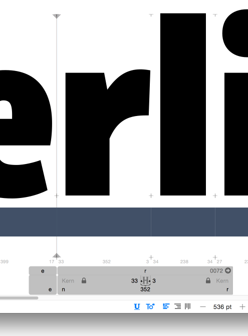

# ShowUnderline

A Plugin for [Glyphsapp](glyphsapp.com). It installs an icon into the bottom toolbar and draws a preview of the underline.

### Installation

Use the Plugin Manager in the Window menu.
or 
- Download the complete ZIP file and unpack it, or clone the repository.
- Double click the .glyphsFilter file. Confirm the dialog that appears in Glyphs.
- Restart Glyphs.
 
### Usage Instructions

1. Set the `underlineThickness` and `underlinePosition` in all masters.
2. Click the <u>`U`</u> icon in the bottom bar.

### Requirements

The plugin needs Glyphs 2.3 (879) or higher, running on OS X 10.9.1 or later.

### License

Copyright 2016 Georg Seifert (@schriftgestalt)

Based on sample code by Georg Seifert (@schriftgestalt) and Jan Gerner (@yanone).

Licensed under the Apache License, Version 2.0 (the "License");
you may not use this file except in compliance with the License.
You may obtain a copy of the License at

http://www.apache.org/licenses/LICENSE-2.0

See the License file included in this repository for further details.